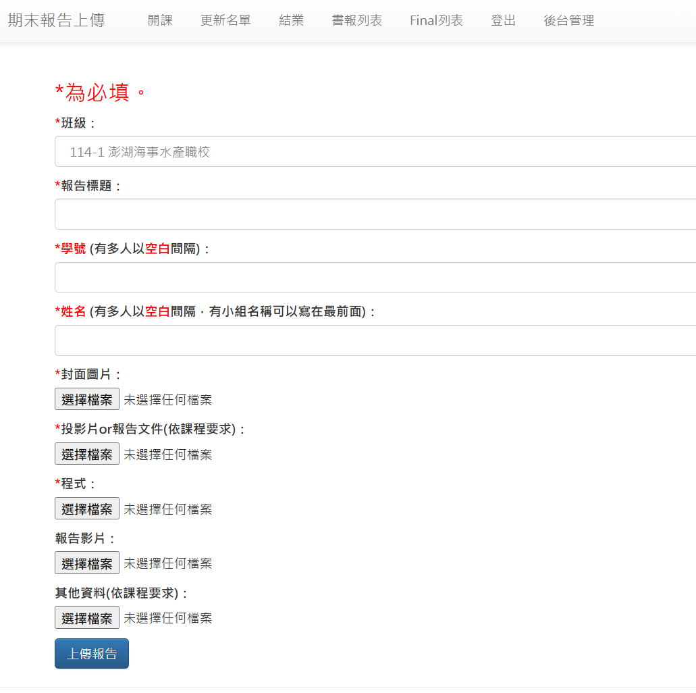

# 114-1 期末專題上傳網址

帳號密碼請向任課老師索取。

<!-- 
report114-1
This@Pa$s
-->

請利用本學期所學，完成一個小專案，並將程式碼與報告上傳至以下對應學校的網址：

學校名稱 | 上傳網址
---|---
澎湖海事水產職校 | http://teded.csie.org:8002/FRupload/?class=114-1_HG_phmhs
花蓮高商 | http://teded.csie.org:8002/FRupload/?class=114-1_HG_hlcvs
仁武高中 | http://teded.csie.org:8002/FRupload/?class=114-1_HG_rwsh
湖口高中 | http://teded.csie.org:8002/FRupload/?class=114-1_HG_hksh
玉里高中 | http://teded.csie.org:8002/FRupload/?class=114-1_HG_ylsh
清水高中 | http://teded.csie.org:8002/FRupload/?class=114-1_HG_qssh
嘉義高工 | http://teded.csie.org:8002/FRupload/?class=114-1_HG_cyvs
台東女中 | http://teded.csie.org:8002/FRupload/?class=114-1_HG_ttgsh
新化高工 | http://teded.csie.org:8002/FRupload/?class=114-1_HG_shvs
南科實中 | http://teded.csie.org:8002/FRupload/?class=114-1_HG_nssh
永年高中 | http://teded.csie.org:8002/FRupload/?class=114-1_HG_ynsh
高雄中學 | http://teded.csie.org:8002/FRupload/?class=114-1_HG_ksms
中山工商 | http://teded.csie.org:8002/FRupload/?class=114-1_HG_csvs
台南二中 | http://teded.csie.org:8002/FRupload/?class=114-1_HG_tnsh
鼓山高中 | http://teded.csie.org:8002/FRupload/?class=114-1_HG_gssh
羅東高工 | http://teded.csie.org:8002/FRupload/?class=114-1_HG_ldvs
花蓮高中 | http://teded.csie.org:8002/FRupload/?class=114-1_HG_hlsh

### 上傳檔案說明

請準備下列檔案並上傳：

- 封面圖片：`jpg` 或 `png`（建議 1280×720，檔案小於 5 MB）
- 投影片（簡報）：`pdf` 或 `pptx`，報告長度控制在 5–10 分鐘內（建議 5–10 頁），講稿附在註解或備忘稿中。
- 程式碼檔案：`*.py`、`*.ipynb` 或 `*.zip`（若以 zip 打包，請包含所有相依檔案與 `README.md`，說明執行步驟）
- 報告影片：`mp4`，錄製在 10 分鐘以內，檔案大小不超過 200 MB（建議 720p；影片請可直接播放）

小提醒：
- 檔名建議格式：學校_姓名_專題名稱.ext（例如：XX高中_王小明_交通偵測.mp4）
- 上傳前請確認壓縮檔可解壓、程式能依說明執行、影片可正常播放
- 若檔案過大請先壓縮或簡化內容，避免上傳失敗
- 請確認上傳完畢，出現確認頁面才關閉網頁，以免上傳失敗！

