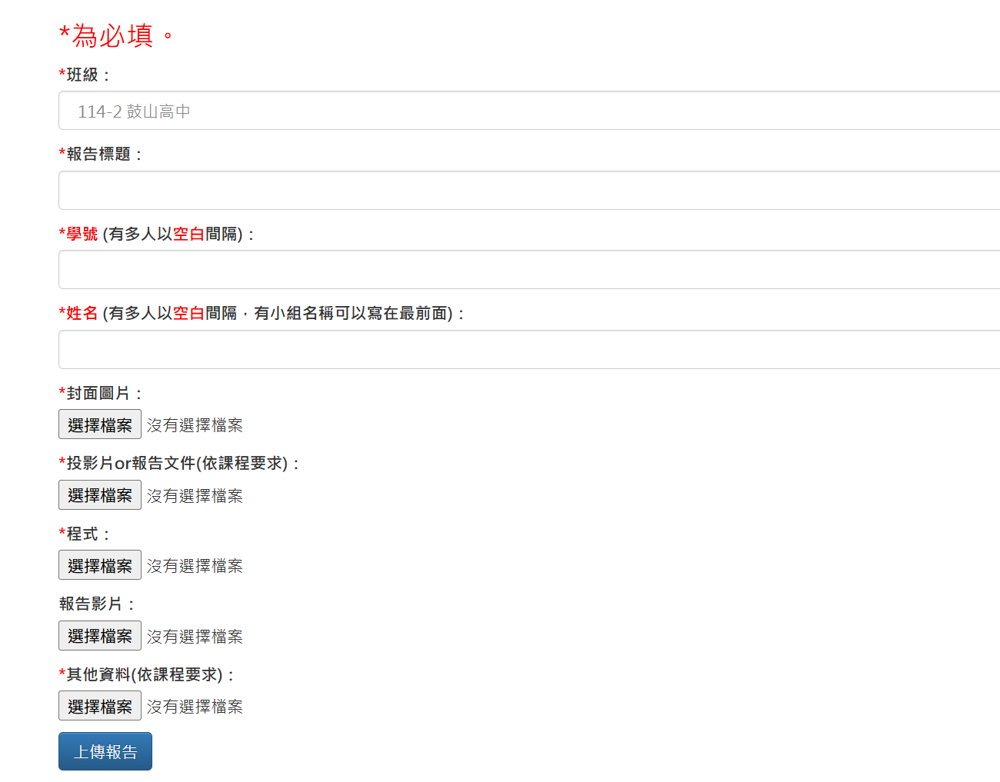

# 114-2 期末專題上傳網址

帳號密碼請向任課老師索取。

<!-- 
report114-2hg
This@Pa$s2
-->

請利用本學期所學，完成一個小專案，並將程式碼與報告上傳至以下對應學校的網址：(注意不要傳錯學校了喔！)

學校名稱 | 上傳網址
---|---
鼓山高中 | http://teded.csie.org:8002/FRupload/?class=114-2_HG_gssh
仁武高中 | http://teded.csie.org:8002/FRupload/?class=114-2_HG_rwsh
台南二中 | http://teded.csie.org:8002/FRupload/?class=114-2_HG_tnsh
宜蘭高中 | http://teded.csie.org:8002/FRupload/?class=114-2_HG_ylhs
花蓮高中 | http://teded.csie.org:8002/FRupload/?class=114-2_HG_hlsh
南投高中 | http://teded.csie.org:8002/FRupload/?class=114-2_HG_ntjh
馬祖高中 | http://teded.csie.org:8002/FRupload/?class=114-2_HG_mlsj
高雄中學 | http://teded.csie.org:8002/FRupload/?class=114-2_HG_ksms
輔仁高中 | http://teded.csie.org:8002/FRupload/?class=114-2_HG_fjsj
新竹縣立湖口高中 | http://teded.csie.org:8002/FRupload/?class=114-2_HG_hksh
陽明高中 | http://teded.csie.org:8002/FRupload/?class=114-2_HG_ymsc

### 上傳檔案說明

請準備下列檔案並上傳：

- 封面圖片：`jpg` 或 `png`（建議 1280×720，檔案小於 5 MB）
- 投影片（簡報）：`pdf` 或 `pptx`，報告長度控制在 5–10 分鐘內（建議 5–10 頁），講稿附在註解或備忘稿中。
- 程式碼檔案：`*.py`、`*.ipynb` 或 `*.zip`（若以 zip 打包，請包含所有相依檔案與 `README.md`，說明執行步驟）
- 報告影片(可以的話)：`mp4`，錄製在 10 分鐘以內，檔案大小不超過 200 MB（建議 720p；影片請可直接播放）
- 其他資料：說明你的創意發想與實作過程、心得、反思與AI使用過程！(記得要註明用的是什麼版本的AI，如Colab內建的Gemini、網頁版ChatGPT、Visual Studio Code + Github Copilot + Claude Sonet 4.6 之類的)，注意必須是文字檔，如：學校名稱_姓名.txt / .md / .json。

小提醒：
- 檔名建議格式：學校_姓名_專題名稱.ext（例如：XX高中_王小明_交通偵測.mp4 / XX高中_王小明_交通偵測.zip / XX高中_王小明_交通偵測.py）
- 上傳前請確認壓縮檔可解壓、程式能依說明執行、影片可正常播放
- 若檔案過大請先壓縮或簡化內容，避免上傳失敗
- 請確認上傳完畢，出現確認頁面才關閉網頁，以免上傳失敗！

### 查看已上傳報告

點擊以下網址可查看各學校學生已上傳的專題報告：

學校名稱 | 查看網址
---|---
鼓山高中 | http://teded.csie.org:8002/FRreports/114-2_HG_gssh
仁武高中 | http://teded.csie.org:8002/FRreports/114-2_HG_rwsh
台南二中 | http://teded.csie.org:8002/FRreports/114-2_HG_tnsh
宜蘭高中 | http://teded.csie.org:8002/FRreports/114-2_HG_ylhs
花蓮高中 | http://teded.csie.org:8002/FRreports/114-2_HG_hlsh
南投高中 | http://teded.csie.org:8002/FRreports/114-2_HG_ntjh
馬祖高中 | http://teded.csie.org:8002/FRreports/114-2_HG_mlsj
高雄中學 | http://teded.csie.org:8002/FRreports/114-2_HG_ksms
輔仁高中 | http://teded.csie.org:8002/FRreports/114-2_HG_fjsj
新竹縣立湖口高中 | http://teded.csie.org:8002/FRreports/114-2_HG_hksh
陽明高中 | http://teded.csie.org:8002/FRreports/114-2_HG_ymsc
